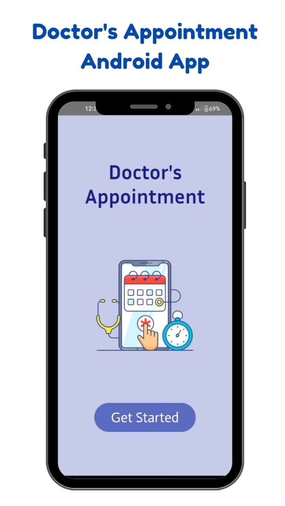

# Doctor’s Appointment Android App

# Introduction

The Doctor's Appointment Android app aims to provide a comprehensive platform facilitating appointment management, personal health record maintenance, and access to healthcare services for both doctors and patients. The app will prioritize a categorized presentation, efficient searching, and implement a robust authentication system, including a thorough verification process for doctors' educational credentials.

# Video Presentation
[Click](https://www.linkedin.com/posts/minhaj47_last-year-i-developed-my-first-fully-functional-activity-7210659851637506049-cDad?utm_source=combined_share_message&utm_medium=member_android)

# Objectives
1. Provide a user-friendly platform for doctors and patients to efficiently manage appointments and personal health records.
2. Ensure the privacy and security of user data through the implementation of a robust authentication system.
3. Facilitate the availability of healthcare services by including a dedicated section for model pharmacies and diagnostic centers. (Optional)
4. Enhance the app's intelligence and adaptability to provide a personalized experience for each user.

# Scope
1. User Profiles:
    - Patients will have the ability to create comprehensive profiles within the app, including personal details, medical history, and preferences. This information will be securely stored for easy access during appointments and consultations.
    - Doctors will have the ability to create detailed profiles, showcasing their qualifications, specialties, and other relevant professional information. This ensures that patients can make informed decisions when selecting a healthcare provider.
2. Appointment Management:
    - Doctors will have a user-friendly interface to handle their appointments, enabling them to view, update, and organize schedules efficiently. Real-time synchronization will ensure that doctors have accurate and up-to-date information at their disposal.
3. Authentication System:
    - The authentication system will include user registration, verification processes, and two-factor authentication to prevent unauthorized access, ensuring the privacy and security of user data.
4. Personal Health Record and Medical History:
    - Patients will have the ability to securely store and manage their complete medical history and personal health records within the app. This feature facilitates better-informed healthcare decisions, ensures continuity of care, and provides doctors with access to relevant patient information during consultations.
5. Model Pharmacy and Diagnostic Centers: (Optional)
    - The app will include a dedicated section providing information about nearby pharmacies and diagnostic centers. Users can access details such as locations, services offered, and contact information, promoting convenient access to essential healthcare services.
6. Summary Upload:
    - Doctors can upload detailed information of appointments directly into the patient's medical histories. This feature streamlines information sharing and ensures that patients have easy access to important details from their healthcare interactions.
7. Intelligent and Adaptable:
    - The app will prioritize personalization, utilizing intelligent features to adapt to each user's needs. This includes personalized appointment recommendations, reminders, and content suggestions based on user behavior and preferences.

# Development Languages, Tools, and Frameworks
- **Frontend Development**:
  - Kotlin: A modern programming language for Android app development, chosen for its concise syntax, null safety, and enhanced readability.
        - Jetpack Compose: A powerful frontend-making tool using Kotlin. This is much more developer-friendly than xml and also more powerful.  
- **Backend Development**:
  - Firebase: Utilized for authentication and real-time data storage.
  - Node.js: As the backend server runtime for handling business logic and data operations.
  - Retrofit: For integrating node server. 
- **Database**:
  - MongoDB: A NoSQL database management system for remote access.
  - Realm: A noSQL local database management System.
 

## Schema Diagram

# Doctor’s Activity

## Profile Management:
- Doctors can create and manage their profiles, including personal details, qualifications, specialties, and professional information.
- The profile serves as a digital representation, allowing patients to make informed decisions when selecting a healthcare provider.

## Comprehensive Appointment Management:
- Doctors have access to a comprehensive appointment management system.
- They can view, update, and organize their schedules, making it easy to keep track of upcoming appointments and manage their availability.
- Real-time synchronization ensures that doctors have accurate and up-to-date information about their appointments.

## Summary Upload:
- After each appointment, doctors can upload summaries directly into the patient's medical histories.
- This feature streamlines information sharing, allowing patients to access important details from their healthcare interactions.

## Availability Management:
- Doctors can set and update their availability within the app.
- This functionality provides flexibility in managing their schedules, ensuring that patients can schedule appointments during the available time slots.

## Integration with Medical Records:
- The app integrates with the medical histories of patients, allowing doctors to access relevant information during consultations.
- This integration enhances the continuity of care, enabling doctors to make well-informed decisions based on the patient's medical history.

## Notification System:
- Doctors receive real-time notifications for appointment confirmations, reminders, and any changes to their schedules.
- The notification system ensures that doctors stay informed and updated about their upcoming appointments.

## Appointment History:
- Stores the appointment histories for further investigation and tracking.

# Patients’ Activity

## Appointment Management:
- **Appointment Scheduling**:
  - Patients can browse available doctors, view their schedules, and schedule appointments based on their preferred time slots.
- **Appointment Management**:
  - Patients can view and manage their upcoming and past appointments, including the ability to cancel or reschedule.

## Patient Health Information:
- **Health Records and Summaries**:
  - Patients can maintain and update their health records within the application.
  - After appointments, patients can access summaries uploaded by doctors, providing a detailed overview of their medical consultations.
  - If prescribed medication, patients can access digital prescriptions within the app.

## Notification System:
- Patients receive real-time notifications for appointment confirmations, reminders, and any changes to their booking.
- The notification system ensures that patient stays informed and updated about their upcoming appointments.

# Authentication Procedure
1. **User Registration with Two-Step Verification**:
  - Users provide essential information and initiate the account creation process using email or phone number.
  - A two-step verification process is implemented:
    - Users receive a verification code on their registered email or phone number.
    - Users enter the received code to complete the registration process.
2. **Doctor Verification Process** (Optional):
  - Submission of BM&DC (Bangladesh Medical & Dental Council) registration number, for validation.
  - Verification may involve a detailed review by a designated authority (Optional).
4. **Legal Agreements**:
  - Doctors sign agreements attesting to the accuracy of the provided information.
  - Includes clauses about legal consequences for false information.

# Conclusion:
The Doctor's Appointment Android app is designed to offer a user-friendly platform for efficient appointment management and personal health record maintenance. The app prioritizes security through a robust authentication system and aims to enhance healthcare service availability. It adopts modern technologies like Kotlin, Firebase, and MongoDB for development. With features like summary upload, and intelligent adaptability, the app aspires to provide a personalized and comprehensive healthcare experience. The outlined Software Requirements Specification and associated documentation provide a clear roadmap for the development of this impactful healthcare management solution.
